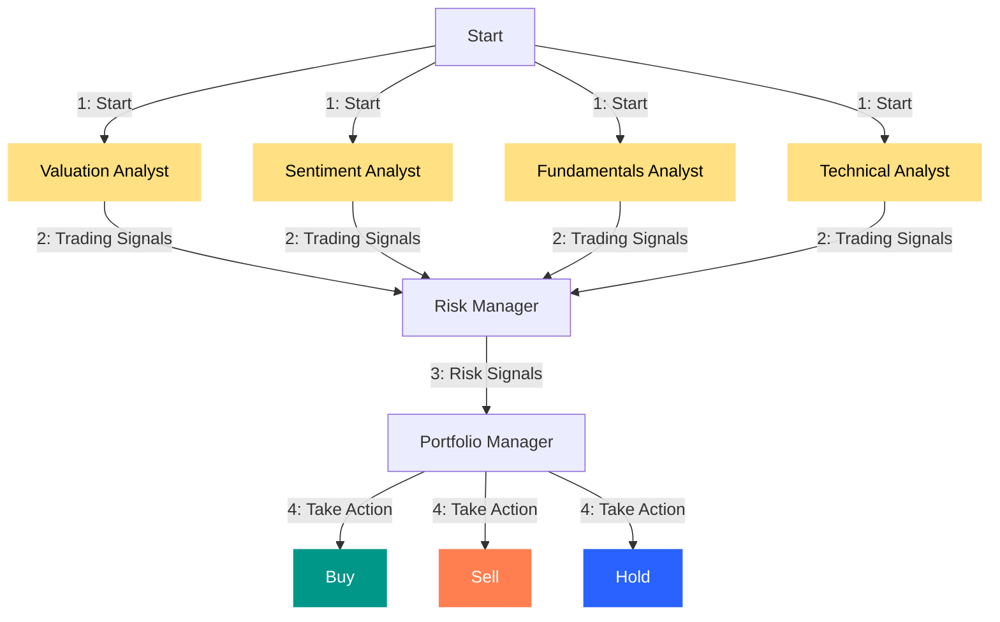
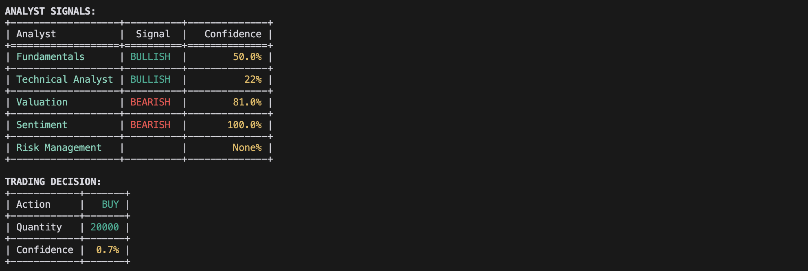
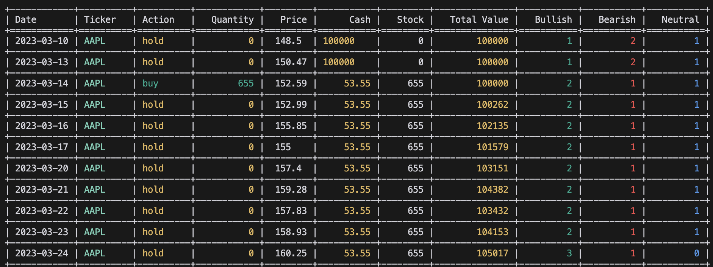

# AI Hedge Fund

This is a proof of concept for an AI-powered hedge fund, designed to explore the use of AI in making trading decisions. The primary purpose of this project is educational and it is not intended for real-world trading or investment.

The system features several agents working collaboratively:

1. **Valuation Agent** - Calculates stock intrinsic value and generates trading signals.
2. **Sentiment Agent** - Analyzes market sentiment to generate trading signals.
3. **Fundamentals Agent** - Examines fundamental data to produce trading signals.
4. **Technical Analyst** - Evaluates technical indicators for generating trading signals.
5. **Risk Manager** - Calculates risk metrics and sets position limits.
6. **Portfolio Manager** - Makes final trading decisions and generates orders.



*Note: The system simulates trading actions without executing real trades.*

## Disclaimer

This project is strictly for **educational and research purposes only**:

- Not suitable for actual trading or investment
- No warranties or guarantees provided
- Past performance does not predict future results
- Creator assumes no liability for financial losses
- Consult a financial advisor before making investment decisions

Use of this software implies agreement to use it solely for learning purposes.

## Table of Contents
- [Setup](#setup)
- [Usage](#usage)
  - [Running the Hedge Fund](#running-the-hedge-fund)
  - [Running the Backtester](#running-the-backtester)
- [Project Structure](#project-structure)
- [Contributing](#contributing)
- [License](#license)

## Setup

Clone the repository and navigate to the project directory:

```bash
git clone https://github.com/LiteObject/ai-hedge-fund.git
cd ai-hedge-fund
```

1. Install dependencies using pip:
   
   ```bash
   pip install -r requirements.txt
   ```

2. Set up your environment variables by copying the example configuration:

   ```bash
   cp .env.example .env
   ```

Update the `.env` file with your Ollama API key (as it replaces the OpenAI API):

```plaintext
# Obtain Financial Datasets API key from https://financialdatasets.ai/
FINANCIAL_DATASETS_API_KEY=your-financial-datasets-api-key
```

**Important**: 

Financial data for AAPL, GOOGL, MSFT, NVDA, and TSLA is available at no cost and does not require an API key. For other tickers, you must set the `FINANCIAL_DATASETS_API_KEY`.

## Usage

### Running the Hedge Fund

To start the hedge fund simulation:

```bash
python src/main.py --ticker AAPL
```

**Example Output:**


You can also include a `--show-reasoning` flag to view detailed reasoning from each agent in the console.

```bash
python src/main.py --ticker AAPL --show-reasoning
```

Optionally, specify start and end dates for decision-making over a specific period:

```bash
python src/main.py --ticker AAPL --start-date 2024-01-01 --end-date 2024-03-01 
```

### Running the Backtester

To backtest strategies:

```bash
python src/backtester.py --ticker AAPL
```

**Example Output:**


You can also specify start and end dates to conduct a backtest over a particular timeframe:

```bash
python src/backtester.py --ticker AAPL --start-date 2024-01-01 --end-date 2024-03-01
```

## Project Structure 

```
ai-hedge-fund/
├── src/
│   ├── agents/                   # Agent definitions and workflow
│   │   ├── fundamentals.py       # Fundamental analysis agent
│   │   ├── portfolio_manager.py  # Portfolio management agent
│   │   ├── risk_manager.py       # Risk management agent
│   │   ├── sentiment.py          # Sentiment analysis agent
│   │   ├── technicals.py         # Technical analysis agent
│   │   ├── valuation.py          # Valuation analysis agent
│   ├── tools/                    # Agent tools
│   │   ├── api.py                # API tools
│   ├── backtester.py             # Backtesting tools
│   └── main.py                   # Main entry point
├── requirements.txt
├── ...
```
